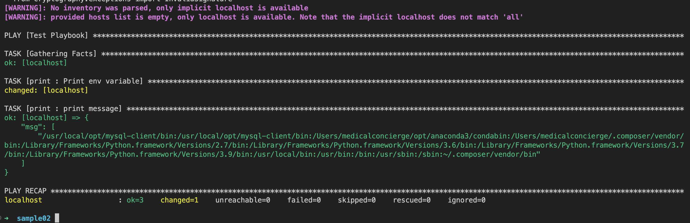

## Ansible Palybook Test

To run the playbook run the commands below

```
cd ansiblesamples 
ansible-playbook main.yml
```

On success you should have the out put as below.


## Second Playbook main-remote

This playbook takes in an inventory file and private key to the instances in the inventory file.

You can create an inventory file with public ip frome aws ec2 instance using the command below
```
aws ec2 describe-instances \                                                              
    --query 'Reservations[*].Instances[*].PublicIpAddress' \
    --output text \
    --profile <aws-user-profile> >> inventory
```

Use the command below to run the new playbook with remote instances

```
ansible-playbook main-remote.yml -i inventory --private-key <path-to-the-private-key>
```